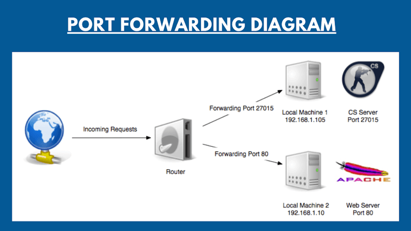

# Port Checker
Free online Port Checker tool that can verify whether the ports of any internet-connected device are open or closed.

What Is a Port Checker and How Does It Work?

<a href="https://www.portcheckers.com/">Port Checker</a> is a free online tool that checks a remote computer or device's Internet connectivity. It can be used to check for open ports or to Ping a remote server. This tool is also useful for <a href="https://www.portcheckers.com/">testing Port Forwarding </a> settings.

The TCP Port Checker attempts to connect to the server and displays a success message on the screen if the connection is successful or if it receives a port open signal. You can't use this tools to check local ports in your computer.. To run this test, your computer or network device must be directly connected to the internet, or a port must be forwarded to the system if connected via a router.
